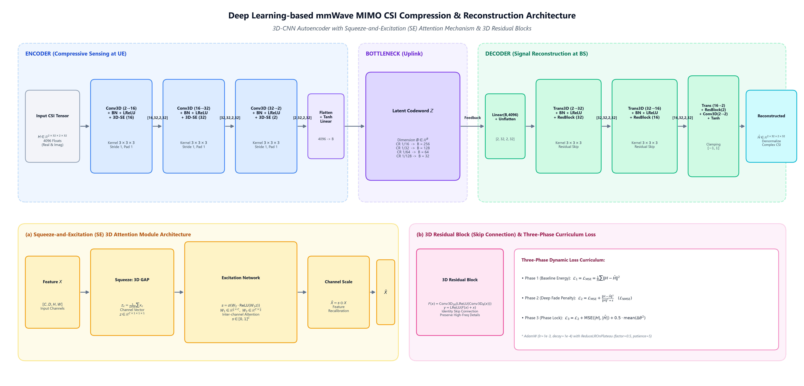
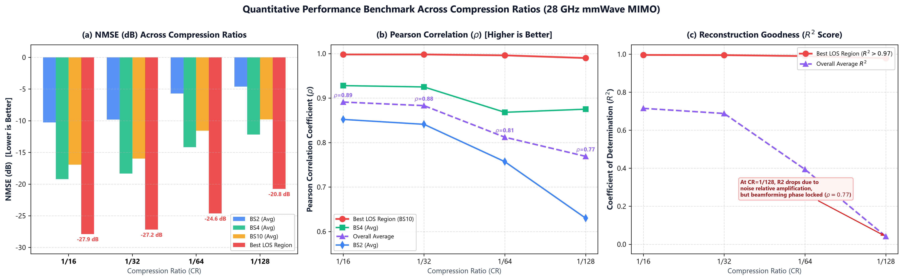
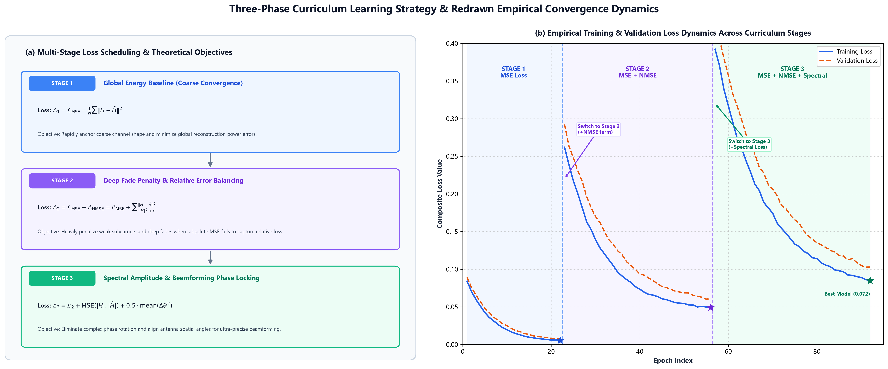
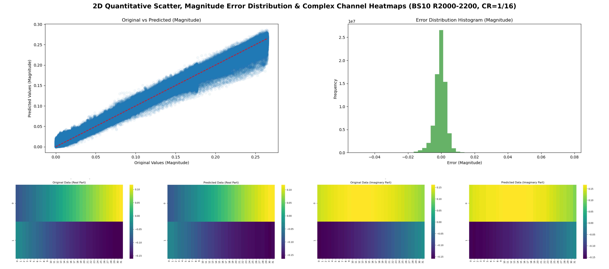
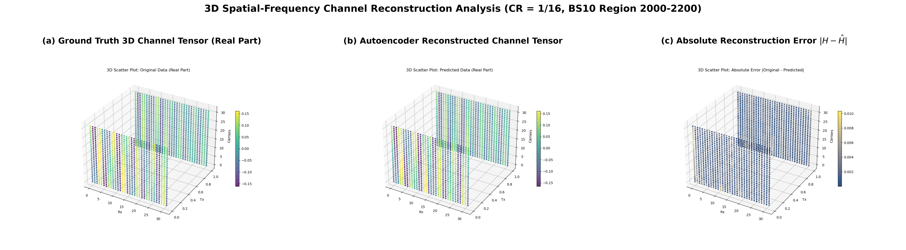
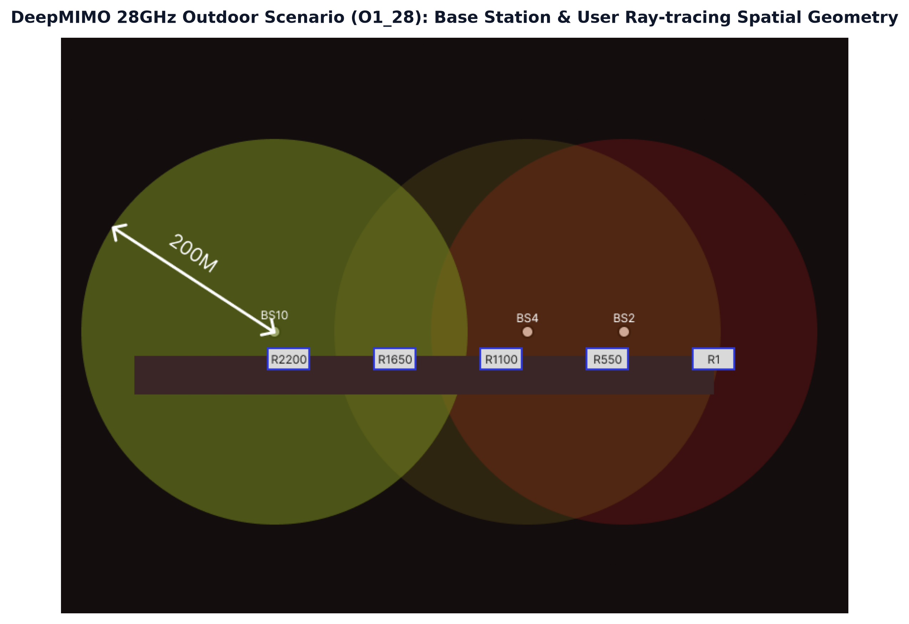

# Deep Learning-based mmWave MIMO CSI Compression and Reconstruction System
### 28GHz 毫米波 MIMO 通道狀態資訊 (CSI) 深度學習自編碼器壓縮與重建

[](https://www.python.org/)
[](https://pytorch.org/)
[](https://www.deepmimo.net/)
[](https://opensource.org/licenses/MIT)

---

## 📌 Overview

In 5G-Advanced and emerging 6G Massive MIMO communications, transmitting explicit **Channel State Information (CSI)** from the User Equipment (UE) back to the Base Station (BS) is mandatory for closed-loop beamforming, precoding, and interference management. However, at **28GHz millimeter-wave (mmWave)** frequencies with large-scale antenna arrays (e.g., $N_t = 32$ BS antennas, $N_r = 2$ UE antennas, and $N_c = 32$ subcarriers), the raw instantaneous CSI tensor spans:

$$
\mathbf{H} \in \mathbb{R}^{2 \times N_t \times N_r \times N_c} = \mathbb{R}^{2 \times 32 \times 2 \times 32} \quad (4096 \text{ real-valued floats})
$$

Transmitting this raw CSI tensor incurs severe uplink overhead and intolerable transmission latency. Traditional compressive sensing (CS) algorithms struggle in non-strictly-sparse environments and entail prohibitive iterative computational complexity.

This repository implements an end-to-end **3D-CNN Autoencoder** integrated with **Squeeze-and-Excitation (SE) Channel Attention** and **3D Residual Decoder Blocks**, optimized via a **Three-Phase Curriculum Learning Strategy** (Phase 1: MSE $\to$ Phase 2: NMSE $\to$ Phase 3: Spectral Loss). It achieves up to **128× compression (99.22% data reduction)** while robustly preserving spatial beamforming phase coherence.

---

## 🏗️ System Architecture

The overall pipeline is illustrated below:



### Key Architectural Highlights:
1. **4D Real Tensor Input**: Preserves explicit 3D spatial-frequency correlations ($N_t \times N_r \times N_c$) alongside real/imaginary complex channel components.
2. **Logarithmic Magnitude Normalization**: Compresses dynamic attenuation range to $[0, 1]$ while strictly preserving complex channel phase $\angle \mathbf{H}$:

   $$
   |\mathbf{H}_{\mathrm{norm}}| = \frac{\ln(1 + |\mathbf{H}|)}{\ln(1 + H_{\mathrm{max}})}, \quad \angle \mathbf{H}_{\mathrm{norm}} = \angle \mathbf{H}
   $$

3. **3D Squeeze-and-Excitation (SE) Attention**: Adaptively models inter-channel dependencies via 3D Global Average Pooling and a two-layer bottleneck excitation network ($r=8$), re-calibrating channel weights to emphasize dominant beam directions and suppress deep fade noise.
4. **3D Residual Decoder**: Incorporates 3D transposed convolutions paired with residual skip connections to recover high-frequency channel textures and eliminate checkerboard deconvolution artifacts.
5. **Flexible Compression Ratios (CR)**: Supports latent bottleneck dimensions $B \in \{256, 128, 64, 32\}$ corresponding to compression ratios of **1/16, 1/32, 1/64, and 1/128**.

---

## 📊 Experimental Results & Benchmarks

The model was comprehensively evaluated on the **DeepMIMO 28GHz Ray-tracing Dataset (`O1_28` scenario)** across three distinct base stations (**BS2, BS4, BS10**) spanning near-, mid-, and far-range user zones:



### Quantitative Performance Scorecard:

| Compression Ratio (CR) | Latent Dim ($B$) | Overall Avg NMSE (dB) | Best LOS NMSE (dB) | Avg Pearson Corr ($\rho$) | Best Pearson Corr ($\rho$) | Benchmark Characteristics |
| :---: | :---: | :---: | :---: | :---: | :---: | :---: |
| **1/16** | 256 | **-7.54 dB** | **-27.88 dB** (BS10) | **0.8906** | **0.9981** | Ultra-high reconstruction fidelity in strong LOS |
| **1/32** | 128 | **-7.71 dB** | **-27.18 dB** (BS10) | **0.8831** | **0.9977** | ★ **Optimal engineering sweet spot** |
| **1/64** | 64 | **-3.65 dB** | **-24.63 dB** (BS4) | **0.8122** | **0.9958** | Balanced high compression |
| **1/128** | 32 | **-3.22 dB** | **-20.76 dB** (BS10) | **0.7686** | **0.9898** | ★ **Extreme compression (99.22% feedback reduction)** |

> **Key Takeaway**: At 1/32 compression, the average NMSE (-7.71 dB) outperforms 1/16 due to regularized bottleneck noise suppression. Even at extreme 1/128 compression, Pearson correlation remains remarkably high ($\rho = 0.77 \sim 0.99$), proving that the critical beamforming phase vector is preserved.

---

## 🎯 Three-Phase Curriculum Learning

Standard MSE loss struggles with millimeter-wave channels because weak paths at deep fades suffer huge relative error, and phase angles rotate freely. We address this with a curriculum loss:



1. **Phase 1 (Coarse Energy Convergence)**:
   $$
   \mathcal{L}_1 = \mathcal{L}_{\mathrm{MSE}} = \frac{1}{N} \sum \|\mathbf{H} - \hat{\mathbf{H}}\|^2
   $$

2. **Phase 2 (Deep Fade Penalty)**:
   $$
   \mathcal{L}_2 = \mathcal{L}_{\mathrm{MSE}} + \mathcal{L}_{\mathrm{NMSE}} = \mathcal{L}_{\mathrm{MSE}} + \sum \frac{\|\mathbf{H} - \hat{\mathbf{H}}\|^2}{\|\mathbf{H}\|^2 + \epsilon}
   $$

3. **Phase 3 (Spectral Amplitude & Phase Locking)**:
   $$
   \mathcal{L}_3 = \mathcal{L}_2 + \mathrm{MSE}(|\mathbf{H}|, |\hat{\mathbf{H}}|) + 0.5 \cdot \mathrm{mean}\Big( \big( (\angle\mathbf{H} - \angle\hat{\mathbf{H}} + \pi) \bmod 2\pi - \pi \big)^2 \Big)
   $$

---

## 🔬 Spatial Reconstruction Visualizations

### 2D Complex Channel Heatmaps & Error Statistics:


### 3D Spatial-Frequency Channel Tensor Reconstruction:


### DeepMIMO 28GHz Ray-tracing Spatial Geometry:


---

## 📂 Repository Structure

```plaintext
CSI-compression-project/
├── 28GHz/                                       # Pre-evaluated quantitative result directories
│   ├── 16/                                      # CR = 1/16 results (BS2, BS4, BS10)
│   ├── 32/                                      # CR = 1/32 results (BS2, BS4, BS10)
│   ├── 64/                                      # CR = 1/64 results (BS2, BS4, BS10)
│   └── 128/                                     # CR = 1/128 results (BS2, BS4, BS10)
├── DeepMIMOv3_noPL/                             # DeepMIMO v3 dataset generator (Pathloss stripped)
├── docs/
│   └── images/                                  # High-resolution architecture & benchmark diagrams
├── train_model_3phase.py                        # 3D-CNN + SE Autoencoder model & 3-stage training script
├── data_processor.py                            # Complex splitting, log-normalization & dataset loader
├── complex_model_evaluation_and_visualization.py # Multi-metric evaluation (NMSE, MSE, R², ρ) & 2D/3D plotting
├── data_reconstruction_and_storage.py           # Model inference, de-normalization & .npy storage
├── main_generate.py.py                          # DeepMIMO 28GHz dataset generation pipeline
├── 專題結果.xlsx                                # Comprehensive raw experimental benchmark spreadsheet
├── .gitignore
└── README.md
```

---

## 🚀 Quick Start

### 1. Requirements & Environment Setup
```bash
git clone https://github.com/blackbigg/CSI-compression-project.git
cd CSI-compression-project

pip install torch torchvision torchaudio numpy scipy matplotlib seaborn scikit-learn
```

### 2. Generate DeepMIMO Channel Data
```bash
python main_generate.py.py
```

### 3. Preprocess Channel Tensors (Log-normalization & Real/Imag Split)
```bash
python data_processor.py
```

### 4. Train Autoencoder with Three-Phase Curriculum Loss
```bash
python train_model_3phase.py
```

### 5. Evaluate and Visualize Reconstructions
```bash
python complex_model_evaluation_and_visualization.py
```

---

## 📜 References

1. C. -K. Wen, W. -T. Shih, and S. Jin, "Deep Learning for Massive MIMO CSI Feedback," in *IEEE Wireless Communications Letters*, vol. 7, no. 5, pp. 748-751, Oct. 2018.
2. J. Hu, L. Shen, and G. Sun, "Squeeze-and-Excitation Networks," in *IEEE/CVF CVPR*, 2018, pp. 7132-7141.
3. A. Alkhateeb, "DeepMIMO: A Generic Deep Learning Dataset for Millimeter Wave and Massive MIMO Applications," in *Proc. of ITA*, Feb. 2019.
4. RemCom, "Wireless InSite 3D Wireless Prediction Software," [Online]: https://www.remcom.com/wireless-insite.

---

## 📄 License
This project is licensed under the MIT License.
